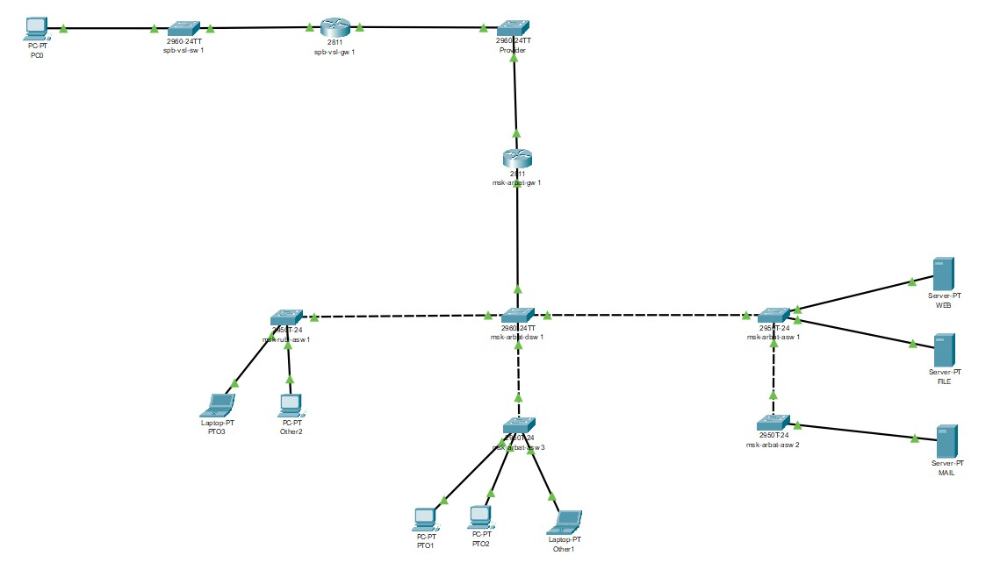
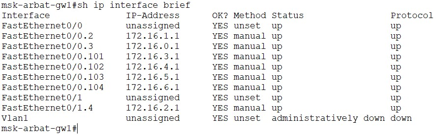
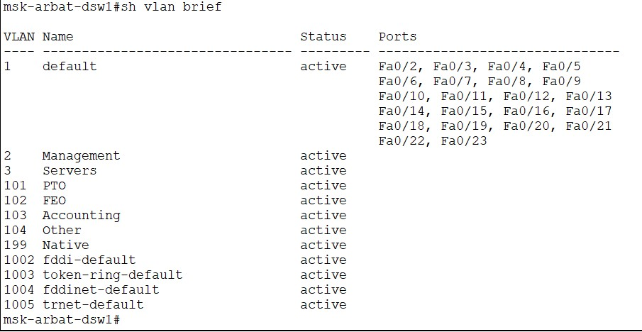

# Enterprise Network Topology Simulation

## Overview

This project is a Cisco Packet Tracer simulation of a small enterprise network infrastructure designed to demonstrate practical networking concepts such as VLAN segmentation, router-on-a-stick configuration, subnetting, switching, and inter-network communication.

The topology includes multiple switches, routers, end-user devices, and internal service servers connected through a structured network architecture.

## Features

* Multi-switch enterprise topology
* VLAN segmentation
* Router-on-a-stick configuration using subinterfaces
* Inter-VLAN routing
* Multiple subnets
* Internal service servers (WEB, FILE, MAIL)
* Simulated provider connection
* End-device communication across VLANs

## Technologies & Concepts Used

* Cisco Packet Tracer
* VLANs
* Trunking
* Router Subinterfaces
* Static IP Addressing
* Inter-VLAN Routing
* Switching & Routing Fundamentals
* Network Topology Design

## Network Topology

The following image shows the overall network architecture used in the simulation.

## Router Configuration Example

The router uses multiple FastEthernet subinterfaces to enable inter-VLAN routing.

Example output of `show ip interface brief`:

## VLAN Configuration

Example output of `show vlan brief`:

## Devices Included

* Cisco 2811 Routers
* Cisco 2960 Switches
* PCs & Laptops
* WEB Server
* FILE Server
* MAIL Server

## Project Goals

The purpose of this simulation is to practice:

* Enterprise network design
* VLAN implementation
* Routing between VLANs
* Network segmentation
* Device configuration and troubleshooting
* Practical Cisco networking concepts

## Author

Tigran Boyakhchyan
